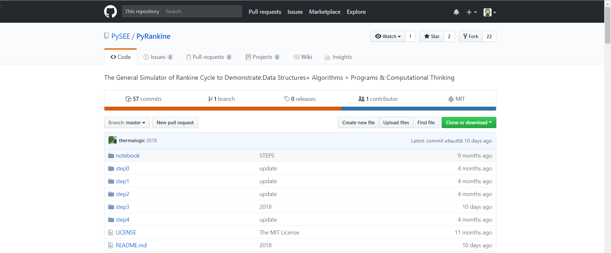

# 软件工程基础及实践practices 1
03015322 唐帆
## 一. 个人Github账户
账户名：TownFan    
电子邮箱: 1844423799@qq.com    
账户主页面截图:

（图1个人Github账户主页面截图）
## 二. Github简介
### 1. 什么是Git?
要了解Github，我们首先要知道Git。Git是管理代码的工具，写代码不是件轻松的事儿，一个人写的时候已经不轻松了，一群人写就更不轻松了，但这世界上很多事都是怎么不轻松怎么来的。大部分人都会和别人一起写代码，问题在于：这么多人写一个东西，你今天写一点，我明天写一点，然后发现你写错了，又影响到了我前天写的，最后汇总的时候怎么查找错误？又在什么时候汇总？这些问题太多了。为了让写代码这件事儿美好一点，我们有了一种名叫代码管理的东西，Git正是其中之一。  
Git的核心思想是『分布式』。我们在服务器上面有一个『主仓库』，这里放的是拿得出台面的代码，我们也可以在自己的电脑上创建分支，这些分支由『主仓库』克隆而来，然后我们就可以愉快的在自己的电脑上写代码了。写完代码可以同步在自己电脑的分支里面，当你觉得自己的代码拿得出台面，我们可以申请把自己的代码更新到『主仓库』里面，一旦通过这样的审核，我们就对『主仓库』做了某种贡献。世界各地的杰出程序员不断的为一个项目的『主仓库』做贡献，让这个项目变得越来越完善。
### 2. 什么是Github？
Github是运用Git思想来工作的一个商业网站。所有开发者都可以在Github上面为自己的项目创建一个『主仓库』，大量的开发者会把这个主仓库中的代码克隆到自己的『分仓库』去，也就是『Fork』。最后通过内建的『pull request』机制向项目负责人申请代码合并。  
Github除了git代码仓库托管及基本的 Web管理界面以外，还提供了订阅、讨论组、文本渲染、在线文件编辑器、协作图谱（报表）、代码片段分享（Gist）等功能。
### 3. Github可以为我们做什么？
1. 学习优秀的开源项目
2. 托管编程环境
3. 用GitHub搭建博客、个人网站或者公司官网
4. 写书
5. 可以作为个人简历
6. 等等
## 三. 课程Home、PyRankine和SEUIF97仓库简介
Home、PyRankine和SEUIF97都是上面所说的“Repository”，我现在已经将它们从PySEE那里fork到了自己的仓库中，相当于我在原项目的主分支上又建立了一个分支，我可以在该分支上任意修改，如果想将我的修改合并到原项目中时，可以pull request，这样原项目的作者就可以将我修改的东西合并到原项目的主分支上去，这样我就为开源项目贡献了代码，开源项目就会在大家共同的努力下不断壮大和完善。
### 1. Home

（图2 Home仓库内文件截图）

Home仓库内的文件主要是指导学生对Python软件的学习和实践。图中README.md是对该仓库的介绍，包括我们这门课程的学习目标、所需材料和书本、课程内容、课程评分和课程内容更新方法。进入Home仓库后默认打开。notebook文件夹中包含的是Python软件的参考和可供学习的代码。guide文件夹中是对软件学习的指导以及一些其他的参考教程和内容。schedule.md文件是对我们这门课程安排的介绍。
### 2. PyRankine

（图3 PyRankine仓库内文件截图）

郎肯循环是我们专业一个重要的内容，也是我们专业学习和研究的基础。PyRankine仓库主要介绍如何利用Python语言模拟和计算郎肯循环。仓库中文件主要介绍了计算思维和编程技巧，通过一步一步拆分讲解的方式，并且给出了郎肯循环的一个编程示例和许多参考网站和教程。
### 3. SEUIF97

（图4 SEUIF97仓库内文件截图）

EUIF97仓库是我校开发者开发的水和水蒸气性质的计算模型共享库，基于IAPWS-IF97，使用Python语言编写，以便我们以后在工程实际中用来模拟水和水蒸气的热力性质，提高水和水蒸气性质的计算速度。仓库中的文件主要介绍了在不同开发环境下的使用方法，给出了很多DEMO程序，可供交互学习。

